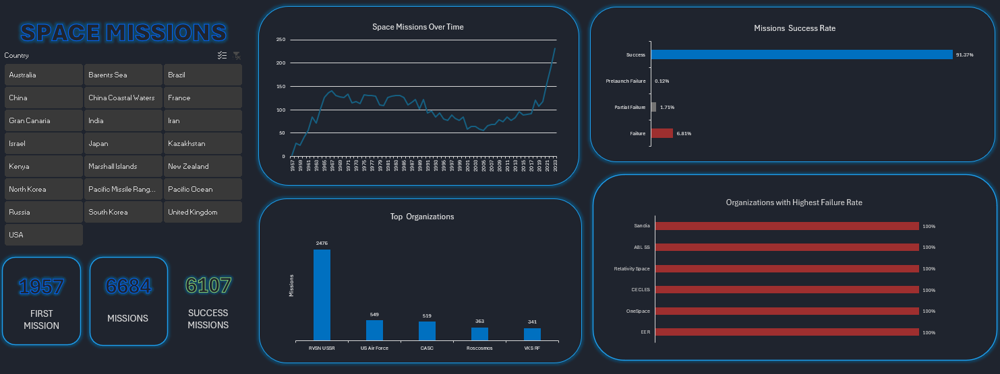
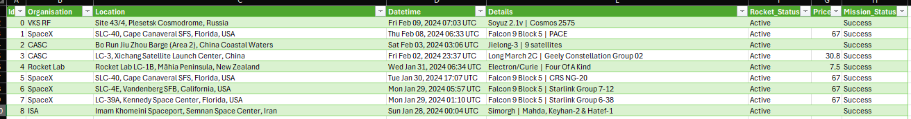
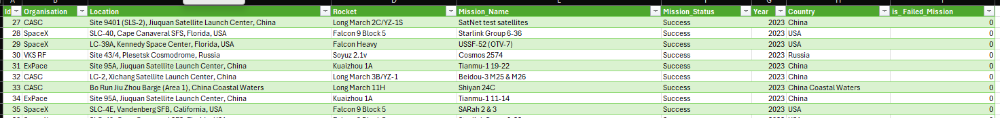

### Project Overview
An interactive dashboard designed for a comprehensive analysis of historical trends and the effectiveness of space missions since the dawn of the space age (1957) until the end of 2023. This project shows how I cleaned and prepared raw data in Excel (ETL) to build an interactive analytical panel.

### 🚀 Dashboard Preview




### 🧠 Key Insights from the Dashboard
Looking at the dashboard charts, here are the most straightforward takeaways:

🚀 Out of **6,684 total historical missions**, an impressive **6,107 ended in full success**. This means that **over 91% of all space launches in history succeeded**. Standard failures sit below 7%, while critical failures right on the launchpad (Prelaunch Failure) account for a tiny fraction (0.12%).

🚀 The United States and Russia remain the historical leaders in the number of space missions, with 2,040 and 1,812 launches respectively. 

🚀 Russia achieved a slightly higher historical mission success rate (94.26%) compared to the United States (89.85%).

🚀 China has completed 568 missions since 1970. The program is growing fast, mainly driven by CASC.

🚀Since 2000, India has been highly active in space, completing 91 missions (mostly by ISRO).

### 🛠️ ETL Challenges & Data Preparation
The raw input dataset contained formatting anomalies and unstructured text, which blocked initial attempts at Pivot Table aggregation and timeline building. Below are the key challenges and how they were resolved:

* **Timeframe Filtering (Removing 2024 Data):**
  The raw dataset included incomplete data from the beginning of 2024. I made a deliberate decision to exclude these records and cap the analysis at the end of 2023, preventing incomplete year data from skewing the annual trendlines.

* **Challenge 1:**
  The `Datetime` column contained an unprocessable text string (e.g., `Fri Feb 09, 2024 07:03 UTC`). English month abbreviations were blocked by regional system settings, and messy metadata prevented aggregation by year or month.
  * *Solution:* I split the string using *Text to Columns*, discarding the days of the week and the `UTC` timezone. Next, I applied the `SWITCH` function to automatically translate English month names into their numerical equivalents (e.g., `Feb` $\rightarrow$ `2`). After merging the elements, I used *Text to Columns* once more with the **Date: DMY** format, forcing the system to fully recognize the native date (format `DD/MM/YYYY`). This unlocked the ability to plot a smooth *Space Missions Over Time* trendline.

* **Challenge 2:**
 The `Location` column contained full text addresses (e.g., *Site 96, Jiuquan Satellite Launch Center, China*). For geographical analysis and filtering, I needed to isolate only the country name (the text after the last comma).
  * *Solution (Modern Formula):* I leveraged Excel 365's modern text engine to safely extract text after the final delimiter. The `-1` argument tells the formula to search backwards from the end of the string, while `TRIM` cleans up any leading or trailing spaces:
    ```excel
    =TRIM(TEXTAFTER([@Location], ",", -1))
    ```
  * *Alternative Approach:* To optimize workflow speed, I also tested the **Flash Fill ($Ctrl + E$)** feature. After providing the first example as a pattern, Excel flawlessly populated over 6,000 rows in a split second, proving the efficiency of hybrid ETL techniques.

### 🧰 Tools & Technologies Used
* **MS Excel / Power Query:** Advanced ETL processing, text data cleansing, data type conversions, and preparing optimal structures for Pivot Tables.

### 📊 Datasets & Data Sources
A historical log containing status, location, organization, and date details of every space mission since 1957.
* **Source:** Kaggle - https://www.kaggle.com/datasets/mzeeshanaltaf/space-mission-dataset-1957-2024?resource=download
* **License:** CC0: Public Domain / Open Source

---

## 📁 Repository Structure / Struktura Repozytorium

* `space_missions.xlsx` - The Excel dashboard file.
* `space_missions_raw.csv` - Raw dataset before the cleansing process.
* `space_missions_cleaned.csv` - Cleansed and fully normalized space mission dataset
* `images/` - Directory containing dashboard screenshots for documentation.
